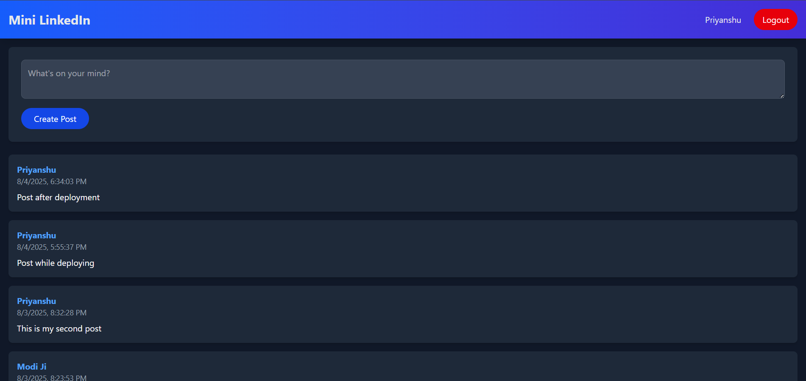
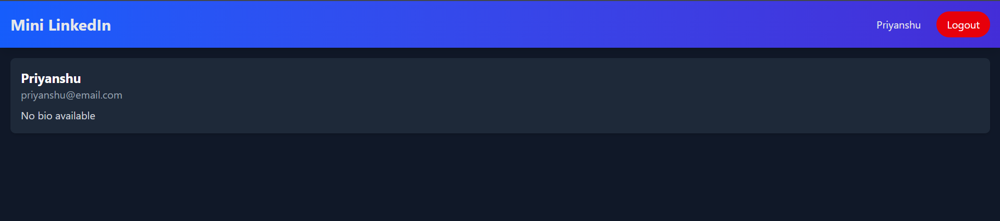
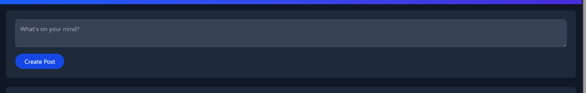
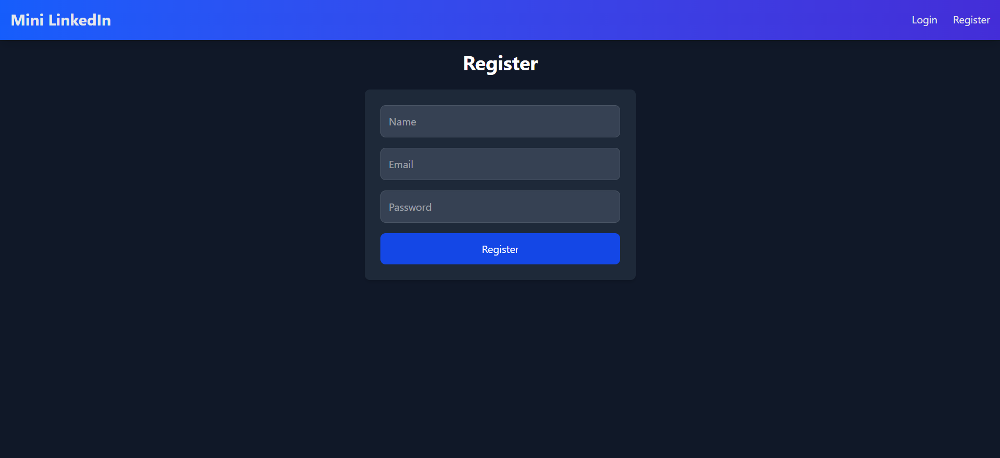
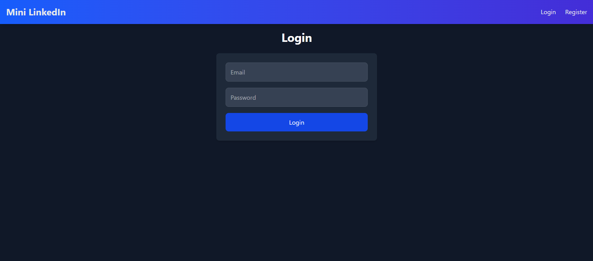

# ✅ LinkedIn MERN Clone

A responsive and full-stack **LinkedIn-inspired application** built with the **MERN Stack** (MongoDB, Express, React, Node.js). Users can register, log in, create profiles, and manage posts securely — all with a sleek dark-mode UI.

---

## 🚀 Features

- 🔐 **Authentication (JWT-based)**  
  Register, login, and secure access to personal profiles and posts
- 📝 **Profile Management**  
  Create and view user profiles
- 📌 **Post Creation & Management**  
  Create, read, and delete posts
- 🎨 **Dark Mode UI with Animations**
- ⚡ **Instant UI Updates**
- 💻 **Responsive Design**  
  Works across desktop, tablet, and mobile

---

## 🛠️ Tech Stack

### 🔹 Frontend:
- React (Vite)
- React Router
- Axios
- Tailwind CSS

### 🔹 Backend:
- Node.js
- Express.js
- MongoDB & Mongoose
- JWT (Authentication)
- dotenv

---

## 🔐 Authentication Flow

- User registration & login
- JWT stored in `localStorage`
- Auth context handles login/logout globally
- Protected backend routes with middleware
- Posts and profiles are user-specific

---

## 🌐 Live Demo

> 🚀 [LinkedIn MERN Live](https://linkedin-mern-j8u3.onrender.com)  
> *(Hosted using Render as a single web service — may take a few seconds to wake up if idle)*

---

## 🖥️ Screenshots

  
  
  
  


---

## 📦 Installation & Setup

```bash
git clone https://github.com/Priyanshu-010/LinkedIn-Mern

### 🔧 Backend  

cd backend
npm install
npm run dev

# Create a .env file in the backend folder with:

PORT=3000
DB_URI=your_mongodb_atlas_connection_string
JWT_SECRET=your_jwt_secret

### 🔧 Frontend

cd frontend
npm install
npm run dev

# Build for production (optional)
npm run build

---

## 🚀 Deployment

- Deployed as a single web service on Render.
- Ensure MongoDB Atlas IP whitelist includes `0.0.0.0/0` (allow all IPs) for development/testing.

---

✍️ Author
Made with ❤️ by Priyanshu Rai

🌐 GitHub: https://github.com/Priyanshu-010

💼 LinkedIn: https://www.linkedin.com/in/priyanshuraidev

---

## 📜 License

This project is licensed under the MIT License - see the [LICENSE](LICENSE) file for details.